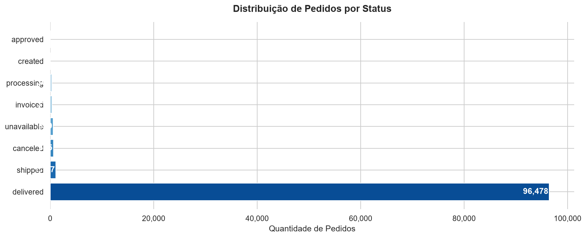
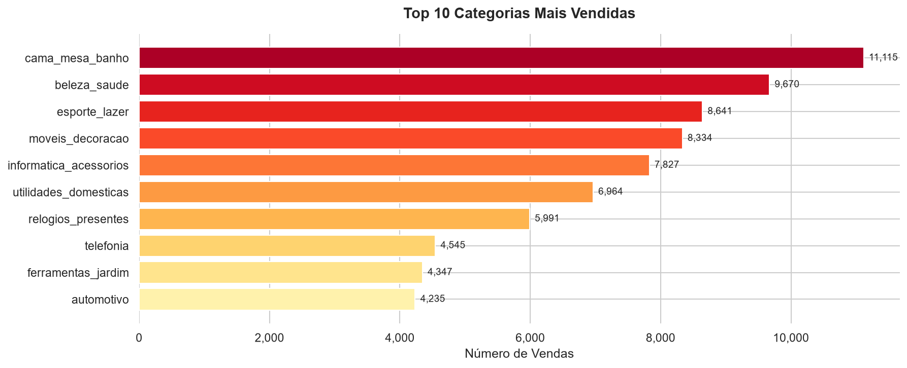
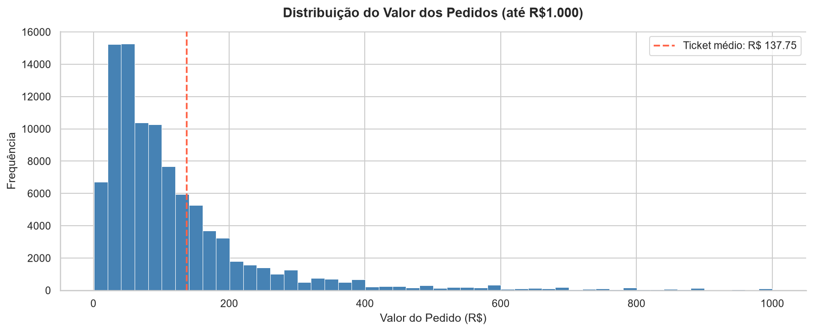
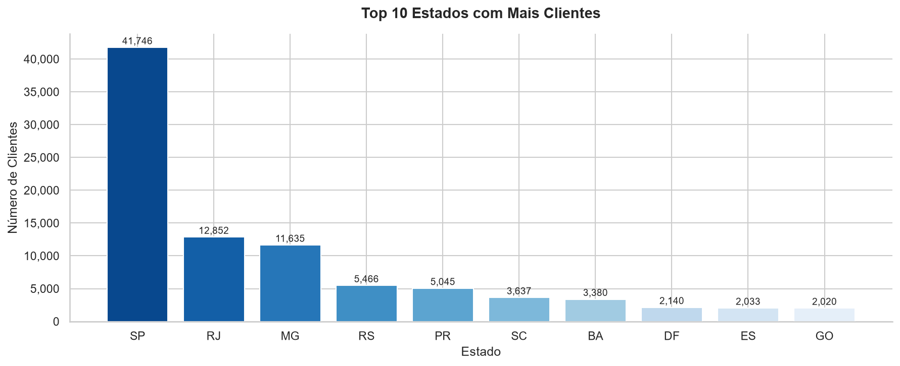

# 📦 Análise de E-commerce — Olist

## Sobre o Projeto
Análise exploratória do dataset público da Olist, maior marketplace brasileiro.  
O objetivo foi responder perguntas de negócio usando **SQL** e **Python**, gerando visualizações dos principais insights.

## Dados
- **Fonte:** [Kaggle — Brazilian E-Commerce Public Dataset by Olist](https://www.kaggle.com/datasets/olistbr/brazilian-ecommerce)
- **Volume:** ~100 mil pedidos, ~113 mil itens, ~100 mil clientes, ~33 mil produtos
- **Tabelas utilizadas:** olist_orders, olist_order_items, olist_products, olist_customers

## Perguntas Respondidas
- Qual a distribuição dos pedidos por status?
- Quais as categorias de produtos mais vendidas?
- Qual o ticket médio dos pedidos?
- Quais os estados com mais clientes?
- Qual a receita total da plataforma?

## Principais Insights

| Métrica | Resultado |
|---|---|
| Taxa de entrega com sucesso | 96% |
| Categoria mais vendida | Cama, mesa e banho (11.115 vendas) |
| Ticket médio por pedido | R$ 137,75 |
| Estado com mais clientes | São Paulo (42%) |
| Receita total | R$ 13.591.643,70 |

## Visualizações

## Ferramentas
- SQL (SQLite)
- DB Browser for SQLite
- Python (Pandas, Matplotlib, Seaborn)
- Jupyter Notebook

## Como Reproduzir
1. Baixe o dataset no [Kaggle](https://www.kaggle.com/datasets/olistbr/brazilian-ecommerce)
2. Coloque os arquivos CSV na mesma pasta que o notebook
3. Abra o arquivo `analise_olist.ipynb` no Jupyter Notebook e execute todas as células
